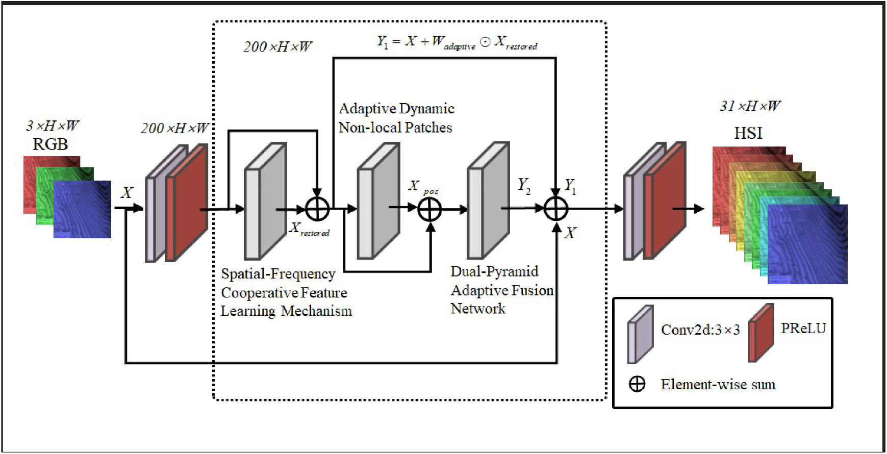
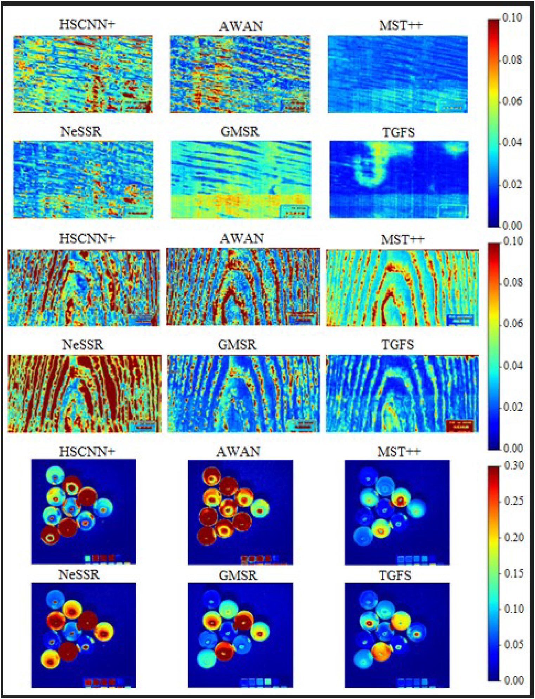
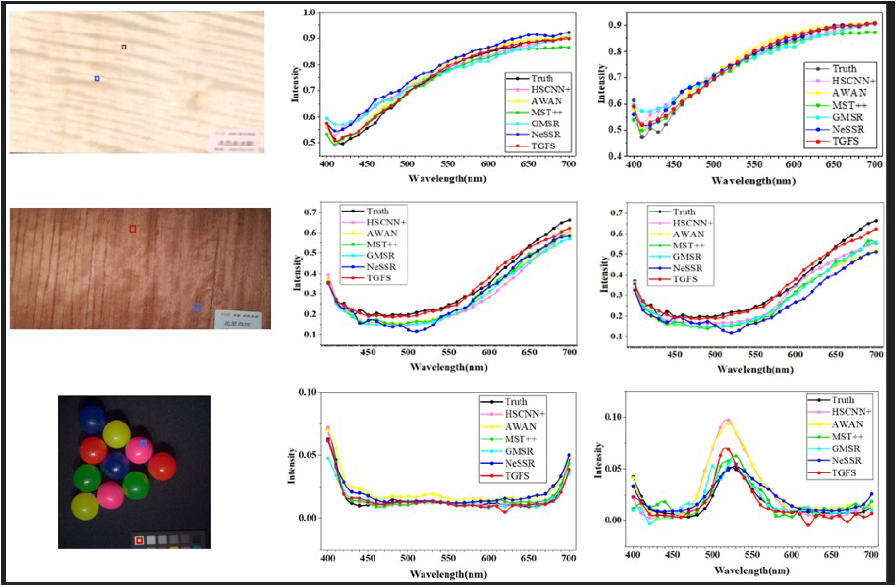
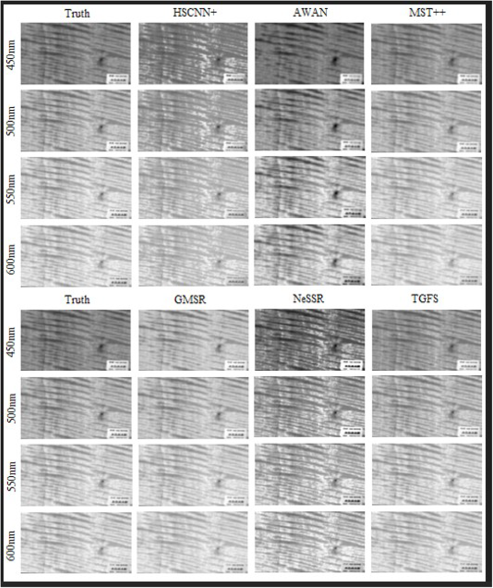
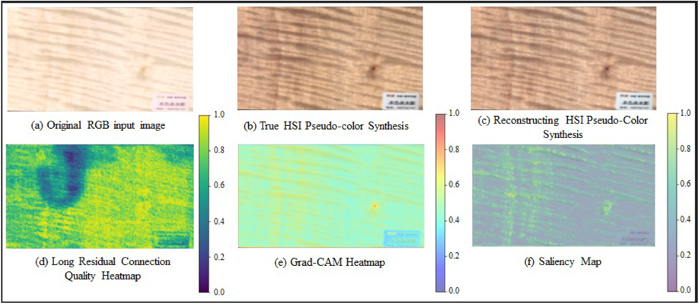

# TGFS-Net

TGFS-Net reconstructs 31-band hyperspectral images from RGB inputs. The network is designed for the directional textures found on wood surfaces and combines spatial-frequency feature learning, adaptive non-local patches, and dual-pyramid feature fusion in a single reconstruction pipeline.



## Model

- Spatial-Frequency Cooperative Feature Learning
- Adaptive Dynamic Non-local Patches
- Dual-Pyramid Adaptive Fusion
- Dual residual feature refinement
- RGB-to-31-band HSI reconstruction

The default input shape is `B x 3 x H x W`, and the output shape is `B x 31 x H x W`. The configuration used in the paper has `channels=200` and four pyramid levels.

## Reconstruction results

Reconstruction error heatmaps for different methods are shown below. Lower-error regions are closer to blue.



Spectral response curves sampled at different spatial positions:



Grayscale reconstruction results at 450 nm, 500 nm, 550 nm, and 600 nm:



Input, reconstructed output, and network response visualization:



## Requirements

- Python 3.10+
- PyTorch 2.1+
- CUDA 11.8+ or CUDA 12.x

```bash
conda create -n tgfs python=3.10 -y
conda activate tgfs
pip install -r requirements.txt
```

## Dataset

The dataset uses HDF5-based `.mat` files. Each file must contain:

- `rgb`: `H x W x 3`
- `hsi`: `H x W x 31`

```text
data/
├── Train1/
├── Train2/
├── Train3/
├── Train4/
├── Valid/
└── Test/
```

Use `--rgb-key` and `--hsi-key` if the dataset uses different field names.

## How to run

### Train

```bash
python train.py \
  --train-dir data/Train1 \
  --train-dir data/Train2 \
  --train-dir data/Train3 \
  --train-dir data/Train4 \
  --val-dir data/Valid \
  --output-dir runs/tgfs_net \
  --epochs 150 \
  --batch-size 8 \
  --patch-size 64 \
  --channels 200 \
  --levels 4 \
  --amp
```

Resume training from the latest checkpoint:

```bash
python train.py \
  --train-dir data/Train1 \
  --val-dir data/Valid \
  --output-dir runs/tgfs_net \
  --resume runs/tgfs_net/last.pth \
  --amp
```

Training produces the following checkpoints:

```text
runs/tgfs_net/
├── best.pth
└── last.pth
```

### Test

```bash
python test.py \
  --test-dir data/Test \
  --checkpoint runs/tgfs_net/best.pth \
  --save-dir results \
  --channels 200 \
  --levels 4
```

The test script reports PSNR, RMSE, and MRAE. Each reconstructed 31-band image is saved as a `.npy` file.

## Project structure

```text
.
├── assets/
├── datasets/
│   ├── __init__.py
│   └── hsi_dataset.py
├── losses/
│   ├── __init__.py
│   └── unified_loss.py
├── utils/
│   ├── __init__.py
│   ├── checkpoint.py
│   ├── metrics.py
│   └── seed.py
├── model.py
├── train.py
├── test.py
└── requirements.txt
```

## Reference

Xuemei Guan, Yingli E, Pengyan Zhuang, Zijun Xia. TGFS-Net: Texture-guided frequency-spatial attention network for hyperspectral reconstruction of anisotropic wood. Expert Systems with Applications, 322, 132286, 2026. https://doi.org/10.1016/j.eswa.2026.132286

The architecture and experimental figures in this README are reproduced from the paper.
